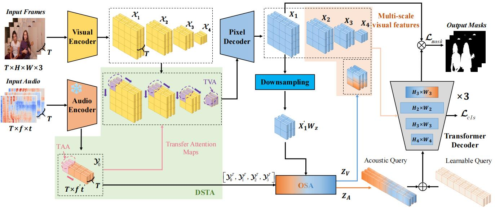

## AV2TS
This repository provides the PyTorch implementation for the paper "AV2TS: A Multivariate Time Series Modeling Framework for Audio-Visual Segmentation", which is submitted to IEEE Transactions on Multimedia.

## Abstract
Audio-visual segmentation (AVS) is a challenging multimodal
task that needs to fuse the spatial-temporal audio-visual features to
achieve pixel-wise segmentation of sounding objects. This work presents AV2TS, which is a novel spatial-temporal framework for AVS. In contrast to the previous AVS approaches where temporal features are secondarily concerned, we cast AVS as a multivariate time series modeling task in which each frame sequence and its corresponding audio sequence form two time series to highlight the significance of temporal features in AVS. In AV2TS, the perception of each modal sequence is expressed as an intra-series feature extraction process, and the cross-modal fusion task is described as inter-series interactions. Specifically, the intra-series features of the frame and audio sequences are extracted via temporal attention. Moreover, an inter-series cross-modal fusion module is implemented by sharing the shared temporal attention maps of the frame and audio sequences. Additionally, AV2TS contains a one-stream fusion module that unifies the learning and relation modeling processes applied to spatially compact visual features and nontrivial acoustic features. Extensive experiments conducted on three AVSBench datasets demonstrate the state-of-the-art performance of AV2TS in both segmentation and semantic segmentation scenarios.

## Method
<p align="center">
  

<h6 align="center">The architecture of the proposed AV2TS framework. 'TVA' and'TAA' refer to 'temporal visual attention' and 'temporal acoustic attention', respectively. The highlights of AV2TS are three points: (a) The video and audio sequences are interpreted as time series, thus the temporal features are translated to intra-series features and the cross-modal fusion is translated into inter-series interactions. (b) The DSTA module (Dark green) is to implement the temporal feature extraction and fusion of audio-visual features. The temporal feature maps are shared to realize the efficient temporal fusion. (c) The OSA module (Orange-blue gradient) is introduced to fuse the spatial features of two modals. A downsampling module (Sky blue) is used to shrink the size of visual feature map for efficiency purpose.</h6>
</p>

## Preparation
We follow [COMBO](https://yannqi.github.io/AVS-COMBO) to finish the preparation before training and testing the models. The details are as follows:

### 1. Environments

- Linux or macOS with Python ≥ 3.6

```shell
# creat the conda environment
conda env create -f AV2TS.yaml
# activate
conda activate AV2TS
# build MSDeformAttention
cd models/modeling/pixel_decoder/ops
sh make.sh
```
- Preprocessing for detectron2

  For using Siam-Encoder Module (SEM), we refine 1-line code of the detectron2.

  The refined file that requires attention is located at:

  `conda_envs/xxx/lib/python3.xx/site-packages/detectron2/checkpoint/c2_model_loading.py`
  (refine the `xxx`  to your own environment)

  Commenting out the following code in [L287](https://github.com/facebookresearch/detectron2/blob/cc9266c2396d5545315e3601027ba4bc28e8c95b/detectron2/checkpoint/c2_model_loading.py#L287) will allow the code to run without errors:

```python
# raise ValueError("Cannot match one checkpoint key to multiple keys in the model.")  
```

- Install Semantic-SAM (Optional)

```shell
# Semantic-SAM
pip install git+https://github.com/cocodataset/panopticapi.git
git clone https://github.com/UX-Decoder/Semantic-SAM
cd Semantic-SAM
python -m pip install -r requirements.txt
```
Find out more at [Semantic-SAM](https://github.com/UX-Decoder/Semantic-SAM)

### 2. Datasets

Please refer to the link [AVSBenchmark](https://github.com/OpenNLPLab/AVSBench) to download the datasets. You need to put the data under the `./AVS_dataset`. The folder tree shall look like:

```
|--AVS_dataset
   |--AVSBench_semantic/
   |--AVSBench_object/Multi-sources/
   |--AVSBench_object/Single-source/
```

Then run the scripts below to preprocess the AVSS dataset for efficient training.

```shell
python3 avs_tools/preprocess_avss_audio.py
python3 avs_tools/process_avssimg2fixsize.py
```

### 3. Download Pre-Trained Models

- The pretrained visual backbone (ResNet-50 and PVT-v2) is available from benchmark AVSBench pretrained backbones [YannQi/COMBO-AVS-checkpoints · Hugging Face](https://huggingface.co/YannQi/COMBO-AVS-checkpoints).
- The pretrained acoustic backbone (CED-Mini) is available from [CED-Mini](https://huggingface.co/mispeech/ced-mini).

After you finish downloading, put the weights under the `./pretrained`. 

```
|--pretrained
   |--detectron2/R-50.pkl
   |--detectron2/d2_pvt_v2_b5.pkl
   |--audiotransformer_mini_mAP_4896.pt
```

### 4. Maskiges pregeneration

- Generate class-agnostic masks (Optional)

```shell
sh avs_tools/pre_mask/pre_mask_semantic_sam_s4.sh train # or ms3, avss
sh avs_tools/pre_mask/pre_mask_semantic_sam_s4.sh val 
sh avs_tools/pre_mask/pre_mask_semantic_sam_s4.sh test
```

- Generate Maskiges (Optional)

```shell
python3 avs_tools/pre_mask2rgb/mask_precess_s4.py --split train # or ms3, avss
python3 avs_tools/pre_mask2rgb/mask_precess_s4.py --split val
python3 avs_tools/pre_mask2rgb/mask_precess_s4.py --split test
```

- Move Maskiges to the following folder
  
  Note: For convenience, the pre-generated Maskiges for S4\MS3\AVSS subset can be obtained at [YannQi/COMBO-AVS-checkpoints · Hugging Face](https://huggingface.co/YannQi/COMBO-AVS-checkpoints).

The file tree shall look like:
```
|--AVS_dataset
    |--AVSBench_semantic/pre_SAM_mask/
    |--AVSBench_object/Multi-sources/ms3_data/pre_SAM_mask/
    |--AVSBench_object/Single-source/s4_data/pre_SAM_mask/
```

## Train and Test
The scripts for training and testing are put under `./scripts`.
### 1. Train

```shell
# ResNet-50 
sh scripts/res_train_avs4.sh
sh scripts/res_train_avms3.sh
sh scripts/res_train_avss.sh
```

```shell
# PVTv2 
sh scripts/pvt_train_avs4.sh
sh scripts/pvt_train_avms3.sh
sh scripts/pvt_train_avss.sh
```

### 2. Test
After you finish the training process, you can evaluate the best checkpoints by the commands below:
```shell
# ResNet-50 
sh scripts/res_test_avs4.sh
sh scripts/res_test_avms3.sh
sh scripts/res_test_avss.sh
```

```shell
# PVTv2
sh scripts/pvt_test_avs4.sh
sh scripts/pvt_test_avms3.sh
sh scripts/pvt_test_avss.sh
```

## Acknowledgement

This codebase is implemented on the following project. We really appreciate its authors for the open-source works!
- [COMBO](https://github.com/yannqi/COMBO-AVS) [[related paper](https://arxiv.org/pdf/2312.06462)]


**This project is not for commercial use. For commercial use, please contact the author.**

## Citation

If any part of our work helps your research, please consider citing us and giving a star to our repository.


